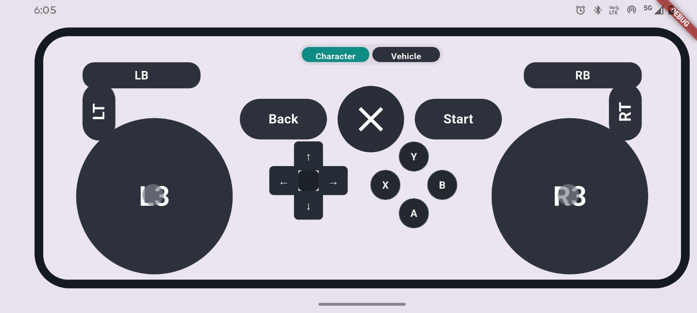
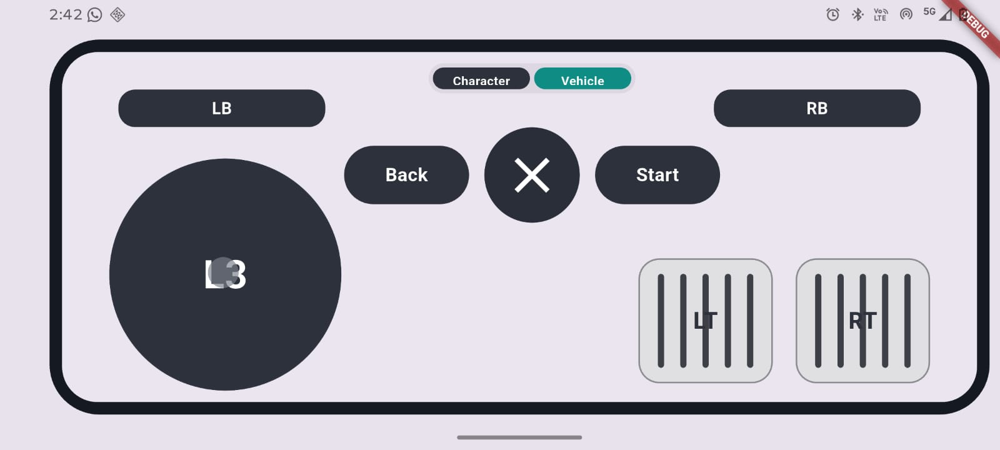

# linux-joystick

`linux-joystick` is a Linux C++ server that:
1. Creates a virtual gamepad with `/dev/uinput`.
2. Receives controller state over UDP.
3. Applies that state to the virtual gamepad.
4. Exposes a UDP discovery endpoint so clients can find the server.

The executable built by this repo is `virtual_remote_server`.

## Virtual Linux Remote 🎮

## System Architecture


## Server Initialization & Runtime Flow


## Discovery Protocol


## Demo Screenshots








## Key Features

- Binary UDP controller input on `9000/udp`.
- UDP discovery service on `9002/udp`.
- Virtual gamepad output via `/dev/uinput`.
- Sender pair-lock with timeout-based unlock.
- Input watchdog that falls back to neutral state on silence.

## Project Layout

- `src/`: runtime implementation (`server_main`, controller engine, UDP receiver, discovery service, virtual gamepad).
- `include/`: protocol, mapping, and public headers used by the server sources.
- `docs/demo/`: architecture diagrams and demo screenshots.
- `CMakeLists.txt`: builds `virtual_remote_server` with C++17.

## Build

```bash
cmake -S . -B build
cmake --build build
```

## Run

```bash
sudo ./build/virtual_remote_server
```

`sudo` (or equivalent permissions) is usually required for `/dev/uinput`.

## Runtime Output

On successful start, the server prints its control and discovery ports and then waits for controller traffic.
